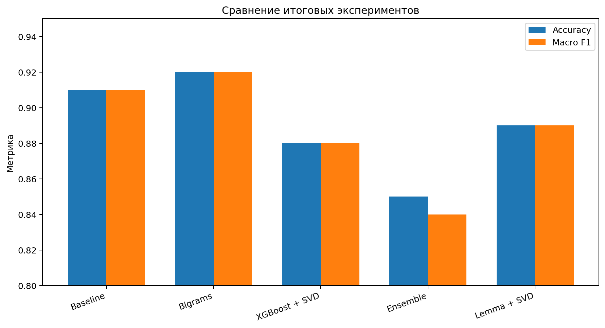
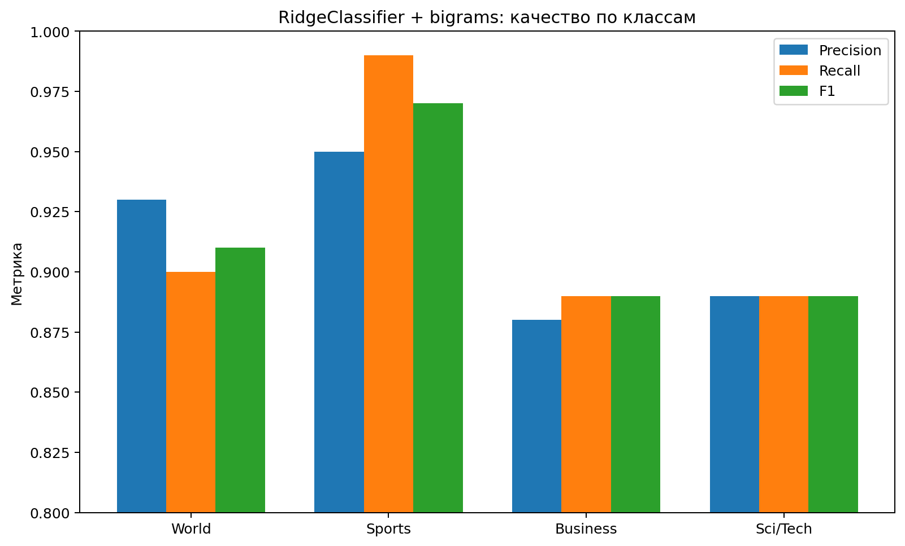

# Классификация новостей AG News

Курсовой проект по задаче **многоклассовой классификации текста** на датасете **AG News Classification Dataset**.

Цель работы — сравнить несколько классических алгоритмов машинного обучения для автоматического определения тематики новости и исследовать, как на качество влияют TF-IDF, биграммы, подбор гиперпараметров, понижение размерности, ансамблирование и изменение предобработки.

## Постановка задачи

По заголовку и краткому описанию новости необходимо предсказать один из четырёх классов:

- `World`
- `Sports`
- `Business`
- `Sci/Tech`

Для оценки моделей использовались `Accuracy`, `Precision`, `Recall` и `F1-score`.

## Данные

В работе используется **AG News Classification Dataset**.

Исходный датасет представлен двумя файлами:

- `train.csv` — 120 000 записей;
- `test.csv` — 7 600 записей.

В рамках курсовой они были объединены в один набор размером **127 600 записей**, после чего выполнено собственное разбиение на train/test.

Тестовая выборка содержит **25 520 объектов** — по 6 380 наблюдений каждого класса.

Каждая запись включает:

- `Class Index` — номер категории;
- `Title` — заголовок;
- `Description` — краткое описание новости.

## Предобработка

В работе выполнялась очистка текста, включая:

- приведение к нижнему регистру;
- удаление HTML-остатков;
- удаление чисел, дефисов и лишних символов;
- работу со stop words;
- объединение заголовка и описания;
- TF-IDF-векторизацию.

Для части экспериментов использовались биграммы:

```python
TfidfVectorizer(
    max_features=15000,
    ngram_range=(1, 2),
    stop_words=custom_stop_words
)
```

Дополнительно исследовались лемматизация и `TruncatedSVD`.

## Первичное сравнение моделей

В базовом сравнении были обучены несколько алгоритмов.

| Модель | Accuracy | Macro F1 | Время, сек. |
|---|---:|---:|---:|
| **RidgeClassifier** | **0.9173** | **0.9171** | 0.77 |
| LinearSVC | 0.9135 | 0.9133 | 4.17 |
| LogisticRegression | 0.9127 | 0.9125 | 3.86 |
| SGDClassifier | 0.9118 | 0.9114 | 0.12 |
| ComplementNB | 0.9077 | 0.9072 | 0.02 |
| MultinomialNB | 0.9061 | 0.9059 | 0.03 |
| KNeighborsClassifier | 0.9037 | 0.9035 | 55.82 |
| RandomForestClassifier | 0.8914 | 0.8910 | 18.26 |

По совокупности качества и скорости наиболее перспективной моделью был выбран `RidgeClassifier`.

## Подбор гиперпараметров RidgeClassifier

Для `RidgeClassifier` был проведён `GridSearchCV`.

Исследовались параметры:

```text
alpha  = [0.01, 0.1, 1.0, 10.0, 100.0]
solver = [auto, lsqr, sparse_cg]
tol    = [1e-5, 1e-4, 1e-3, 1e-2]
```

Лучшие параметры:

```text
alpha = 1.0
solver = auto
tol = 0.01
```

Лучшая кросс-валидационная точность составила около **0.9143**. При этом сам подбор гиперпараметров не дал заметного прироста относительно исходной конфигурации.

## Улучшение модели

После базового сравнения были проведены дополнительные эксперименты:

- добавление биграмм в TF-IDF;
- XGBoost после `TruncatedSVD`;
- ансамбль `RidgeClassifier + RandomForest`;
- лемматизация перед TF-IDF;
- сочетание лемматизации и `TruncatedSVD`.

Итоговая сводка из курсовой:

| Эксперимент | Accuracy | Macro F1 | Sci/Tech Recall |
|---|---:|---:|---:|
| Baseline | 0.91 | 0.91 | 0.88 |
| **RidgeClassifier + bigrams** | **0.92** | **0.92** | **0.89** |
| XGBoost + SVD | 0.88 | 0.88 | 0.85 |
| Ensemble | 0.85 | 0.84 | 0.71 |
| Lemmatization + SVD | 0.89 | 0.89 | 0.85 |



Более сложные подходы в данном эксперименте не улучшили результат: понижение размерности приводило к потере полезной информации, а ансамблирование не дало преимущества над линейной моделью.

## Лучшая модель

Лучшей моделью в итоговой части работы осталась `RidgeClassifier` с TF-IDF-биграммами.

| Категория | Precision | Recall | F1-score |
|---|---:|---:|---:|
| World | 0.93 | 0.90 | 0.91 |
| Sports | 0.95 | **0.99** | **0.97** |
| Business | 0.88 | 0.89 | 0.89 |
| Sci/Tech | 0.89 | 0.89 | 0.89 |
| **Macro avg** | **0.92** | **0.92** | **0.92** |

Общая `Accuracy` на тестовой выборке — **0.92**.



Наиболее уверенно модель распознаёт категорию `Sports`. Основные ошибки в работе наблюдались между категориями `Business` и `Sci/Tech`.

## Что показал эксперимент

Один из важных выводов проекта — усложнение пайплайна не обязательно повышает качество.

`XGBoost + SVD`, ансамбль и лемматизация с понижением размерности уступили более простому решению на основе `RidgeClassifier + TF-IDF`. В рамках этой задачи линейная модель на разреженных текстовых признаках оказалась одновременно эффективной и вычислительно простой.

## Ограничения

- работа выполнена на одном датасете;
- итоговое качество зависит от выбранной схемы очистки текста и TF-IDF;
- более сложные нейросетевые подходы в данной курсовой не исследовались;
- часть экспериментов с SVD приводила к потере информации;
- для более строгой оценки можно дополнительно использовать отдельную validation-выборку и repeated cross-validation.

## Структура репозитория

```text
ag-news-text-classification/
├── README.md
├── requirements.txt
├── .gitignore
├── assets/
│   ├── model_comparison.png
│   └── best_model_class_metrics.png
├── data/
│   └── README.md
└── report/
    └── coursework_ag_news.pdf
```

## Стек

`Python` · `pandas` · `NumPy` · `scikit-learn` · `TF-IDF` · `RidgeClassifier` · `LinearSVC` · `Logistic Regression` · `Naive Bayes` · `SGDClassifier` · `Random Forest` · `KNN` · `XGBoost` · `TruncatedSVD` · `GridSearchCV` · `NLTK` · `Matplotlib` · `Seaborn`
